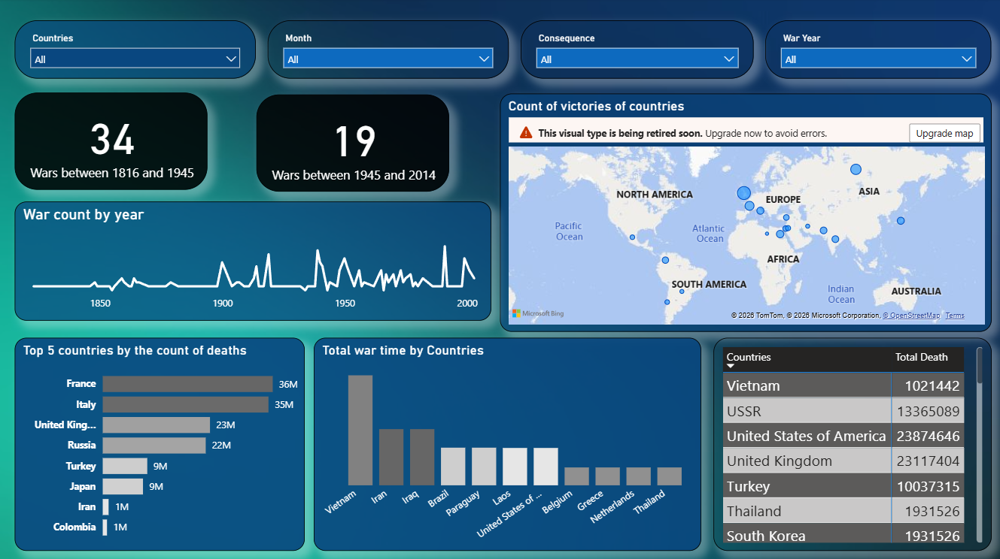
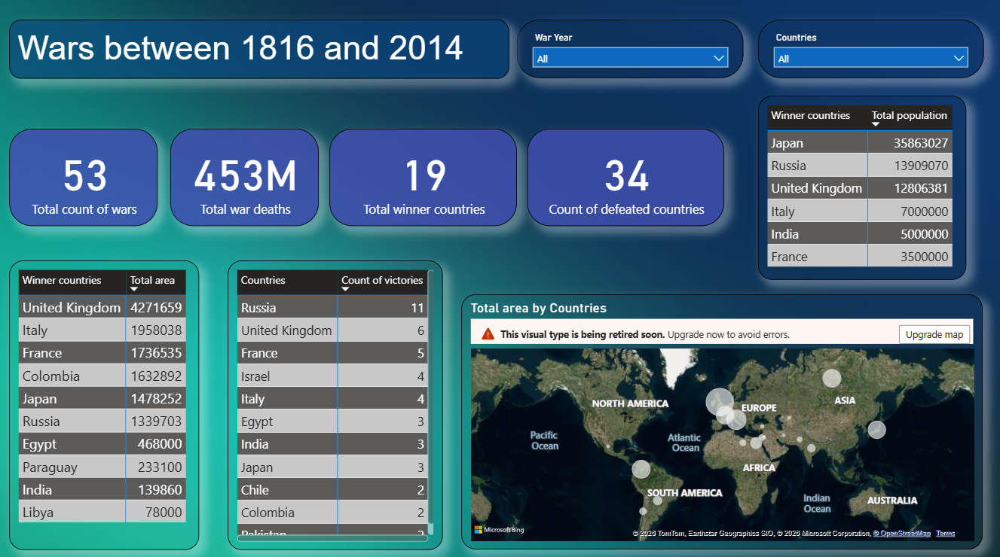
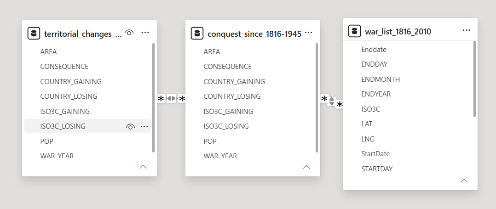

# Wars Analysis (1816–2014)

**A historical conflict analysis project using Oracle SQL and Power BI to explore wars, territorial changes, conquests, casualties, duration, and country-level outcomes from 1816 to 2014.**

---

## Overview

This project analyzes historical conflict data covering wars, territorial changes, and conquests from 1816 to 2014.

The datasets were explored and transformed using Oracle SQL, then visualized in Power BI to identify patterns in:

- War frequency
- War duration
- Total deaths
- Victorious and defeated countries
- Territorial gains
- Conquests
- Country-level conflict trends

**Tech Stack:**  
Oracle SQL · Power BI · CSV · Data Modeling

---

## Dashboard Preview

### Wars Analysis



### Wars Overview



---

## Data Model

The Power BI model connects the main historical conflict datasets used in the analysis.



---

## Data Sources

The project uses multiple historical conflict datasets, including:

- War list data
- Conquests from 1816–1945
- Conquests since 1945
- Territorial changes from 1816–1945
- Territorial changes since 1945
- Combined territorial change datasets

All source datasets are available in:

[`data/`](data/)

---

## Oracle SQL Analysis

Oracle SQL was used to explore, transform, and combine the historical datasets.

The SQL workflow includes operations such as:

- Filtering and aggregating conflict records
- Comparing historical periods
- Combining datasets with `UNION`
- Analyzing countries involved in territorial gains and losses
- Exploring conquest and territorial-change records
- Preparing data for further visualization in Power BI

**SQL Script**

[`War.sql`](sql/War.sql)

---

## Power BI Analysis

The processed data was imported into Power BI and used to build an interactive historical conflict dashboard.

### Key Metrics

The dashboard includes indicators such as:

- Total number of wars
- Total war deaths
- Number of victorious countries
- Number of defeated countries
- Wars before and after 1945
- Country-level victory counts
- Total war duration by country
- Territorial area gained

### Main Analysis Areas

- Historical war trends by year
- War distribution across countries
- Countries with the highest number of victories
- Countries with the highest death totals
- Territorial gains and losses
- Conflict comparison across historical periods
- Geographic distribution of conflict outcomes

**Power BI File**

[`War_analysis.pbix`](powerbi/War_analysis.pbix)

---

## Key Observations

The dashboard enables historical comparisons across different periods and countries.

Examples visible in the analysis include:

- Comparison of wars before and after 1945
- Differences in victory counts between countries
- Variation in total war duration
- Large differences in total casualties
- Geographic concentration of historical conflict activity
- Differences in territorial gains across countries

---

## Repository Structure

```text
wars-analysis-1816-2014/
│
├── data/
│   └── historical conflict CSV datasets
│
├── sql/
│   └── War.sql
│
├── powerbi/
│   └── War_analysis.pbix
│
├── images/
│   ├── wars_analysis_dashboard.png
│   ├── wars_overview_dashboard.png
│   └── powerbi_data_model.png
│
└── README.md
```

---

## Summary

This project demonstrates a complete historical data analysis workflow using SQL and business intelligence tools.

**Historical CSV Data → Oracle SQL Analysis → Power BI Data Model → Interactive Dashboard**
